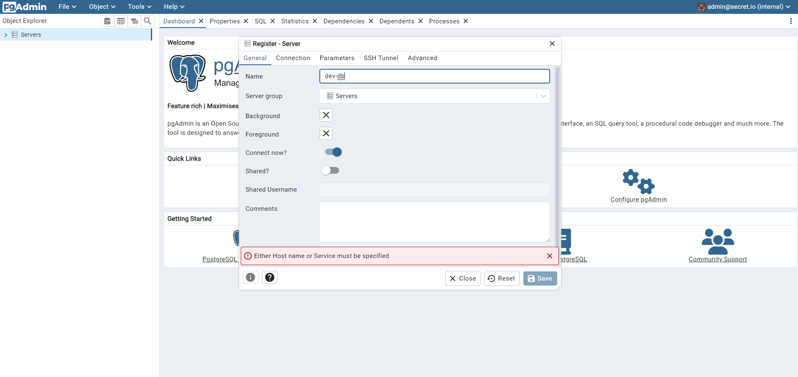

<!-- README.md is generated from README.Rmd. Please edit that file -->

```{r, include = FALSE}
knitr::opts_chunk$set(
  collapse = TRUE,
  comment = "#>",
  fig.path = "man/figures/README-",
  out.width = "100%"
)
```

# R Youth Homelessness Analyzer *(RYHA)*

<!-- badges: start -->
<!-- badges: end -->

The goal of `{ryha}` is to provide a web-based application for in-depth, user-friendly provision & consumption of Youth Homelessness data across the State of Ohio.

## Installation

This Shiny application is built using the [{golem} framework](https://thinkr-open.github.io/golem/), which means that this app is actually an *R package*.

You can install `{ryha}` with:

``` r
# install.packages("devtools")
devtools::install_github("COHHIO/ryha")
```

## Running the App

Before launching the app, you must have the following configurations set, for the purposes of interacting with the external database:

* Environment Variables (for *reading from* & *writing to* the database):
  * `DB_NAME`
  * `DB_HOST`
  * `DB_PORT`
  * `DB_USER`
  * `DB_PWD`
  * `UPLOAD_PWD`
  * `CREATE_DM_ENV`
* The hash keys developed for encrypting the data during write/read to/from the database (stored at the root of the directory, needed for *writing to* the database)

After installing the package, you can launch the app using the package's `run_app()` function.

```{r run_app, eval = FALSE}
ryha::run_app()
```

## Data

### Source

The data within this application are collected by each grantee in a format compliant with the *HMIS Data Standards*. This data originates from one of a few separate HMIS databases in the State. The HMIS databases have the capability to query the database and export a .zip file. This .zip file can be uploaded into the **COHHIO Youth Data Dashboard** app via the app's "*Upload*" page.

### Requirements

The following requirements must be satisfied in order for the .zip file to be successfully processed and its data written to the database:

* The file must be *.zip* extension
* The .zip file must contain (at least) the following .csv files
  * **Client.csv**
  * **Disabilities.csv**
  * **EmploymentEducation.csv**
  * **CurrentLivingSituation.csv**
  * **HealthAndDV.csv**
  * **IncomeBenefits.csv**
  * **Enrollment.csv**
  * **Services.csv**
  * **Project.csv**
  * **Organization.csv**
  * **Exit.csv**
  * **Export.csv**
* The **Organization.csv** file must contain exactly one (1) organization
* The column naming conventions must match the expectations of the *ryha* database

### Data Dictionary

The data dictionary for each element across each file can be found [here](https://files.hudexchange.info/resources/documents/FY-2022-HMIS-Data-Dictionary.pdf). This data dictionary was used to develop the package datasets, which are created in [data-raw](data-raw) and stored in [data](data).

## Architecture

The following architecture diagram shows how the app can be used for both uploading (.zip file) HMIS data, and visualizing previously uploaded HMIS data.


## Development Environment

`.devcontainer` directory contains the necessary files to set up a [development container](https://code.visualstudio.com/docs/devcontainers/containers):

- `.env` defines environmental variables used to configure `{renv}`'s cache. **Remember to change `RENV_PATHS_CACHE_HOST` as appropriate for your system**.
- `devcontainer.json` describes how VS Code should start the container and what to do after it connects. 
- `docker-compose.yml` sets up a development environment with three services:
  - `app`: A custom-built application container that mounts local directories and [runs indefinitely](https://kodekloud.com/blog/keep-docker-container-running/).
  - `db`: A PostgreSQL database container with [persistent storage](https://medium.com/codex/how-to-persist-and-backup-data-of-a-postgresql-docker-container-9fe269ff4334) and [exposed ports for access](https://stackoverflow.com/questions/52567272/docker-compose-postgres-expose-port). Check [db](#db) section for instructions on how to populate the database.
  - `pgadmin`: A [pgAdmin](https://www.pgadmin.org/) container for database management. Check [pgadmin](#pgadmin) section for instructions on how to configure the server.
- `DockerfileDev` contains a set of instructions on how to build the Docker image to run the application in development. **Any new system requirement needed for additional R packages installed must be added to this file**.
- `install_dev_packages.R` runs `renv::restore()` to restore the project's dependencies from the `renv.lock` file. In addition, we use this script to install development packages (i.e. packages that are not needed to run the application but help during development, such as `devtools`). **Add or remove development packages from this script based on your preferences**. This script is run as a `postCreateCommand` in `devcontainer.json` to leverage `{renv}`'s cache.

### Requirements

- [Docker](https://docs.docker.com/engine/install/)
- [VS Code](https://code.visualstudio.com/)
- VS Code's [Dev Container Extension](https://marketplace.visualstudio.com/items?itemName=ms-vscode-remote.remote-containers)

### Container Details

The container uses [Docker Compose](https://docs.docker.com/compose/) to initialize the following **services**:

#### app

**app** creates a container based on `.devcontainer/DockerfileDev`. This file:

- installs the R version used in this project
- installs R packages' system requirements
- installs the `{renv}` version used in this project

In addition, **app** service defines a [Volume](https://docs.docker.com/storage/volumes/) to leverage the use of `{renv}` cache. The `RENV_PATHS_CACHE_HOST` environmental variable needs to be set in `.devcontainer/.env`. Resources:

- [Path for storing global state](https://rstudio.github.io/renv/reference/paths.html). This article can help to find where `{renv}`'s cache is located in your machine.
- [This GitHub Issue comment](https://github.com/docker/for-win/issues/2151#issuecomment-662343075) shows examples on how to state the path when working with a Windows machine.

#### db

**db** creates a postgreSQL database. You can find the credentials under `db`'s `environment` property in `.devcontainer/docker-compose.yml`.

The `ports` property allows the database to be accessible in the host machine (i.e., outside of VS Code Dev Container).

You can connect to the development database using the following code:

```{r, eval=FALSE}
# Connect to dev database
con <- DBI::dbConnect(
  drv = RPostgres::Postgres(),
  dbname = "ryha-dev",
  host = "localhost",
  port = 5432,
  user = "ryha-dev",
  password = "ryha"
)
```

Once the container is created, you can run `postgres/populate_dev_database/populate_dev_database.R` to create and populate the corresponding tables. To run this script you need to store `dm.rds` in the directory `postgres/populate_dev_database/data`. `dm.rds` is a snapshot of the database in production. It needs to be created by someone with access to the production database. The process to generate this object is to read each table in the database into a list of dataframes where each element is named after the table name the data was read from.

#### pgadmin

**pgadmin** provides a graphical administration tool to make it easier to manipulate schema and data in PostgreSQL. Once the container is created, you can access pgAdmin in http://localhost:5050/ with the following credentials (which are defined under `pgadmin`'s `environment` property in `.devcontainer/docker-compose.yml`):

- User: `admin@secret.io`
- Password: `admin`

Once logged in, follow these steps to Register the Server:

1. Go to `Object > Register > Server...`. Alternatively, you can right-click `Servers` as shown below:


2. In `General`, provide a `Name` for the server. For example: `dev-db`.



3. In `Connection`, set the following configuration:

- Host name/address: `db`. This value needs to match the **service** name.
- Port: `5432`
- Maintenance database: `ryha-dev`
- Username: `ryha-dev`
- Password: `ryha`

Maintenance database, Username and Password were defined under `db`'s `environment` property in `.devcontainer/docker-compose.yml`.


4. Click `Save`. If the development database was already populated, you should be able to see the tables with data:


