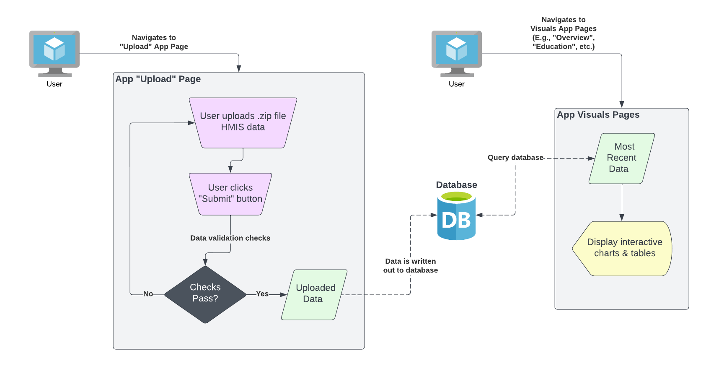

<!-- README.md is generated from README.Rmd. Please edit that file -->

# R Youth Homelessness Analyzer *(RYHA)*

<!-- badges: start -->
<!-- badges: end -->

The goal of `{ryha}` is to provide a web-based application for in-depth,
user-friendly provision & consumption of Youth Homelessness data across
the State of Ohio.

## Installation

This Shiny application is built using the [{golem}
framework](https://thinkr-open.github.io/golem/), which means that this
app is actually an *R package*.

You can install the development version of `{ryha}` from
[GitHub](https://github.com/) with:

``` r
# install.packages("devtools")
devtools::install_github("COHHIO/ryha")
```

## Running the App

Before launching the app, you must have the following configurations
set, for the purposes of interacting with the external database:

- Environment Variables (for *reading from* & *writing to* the
  database):
  - `DB_NAME`
  - `DB_HOST`
  - `DB_PORT`
  - `DB_USER`
  - `DB_PWD`
  - `UPLOAD_PWD`
- The hash keys developed for encrypting the data during write/read
  to/from the database (stored at the root of the directory, needed for
  *writing to* the database)

After installing the package, you can launch the app using the package's
`run_app()` function.

``` r
ryha::run_app()
```

## Data

### Source

The data within this application are collected by each grantee in a
format compliant with the *HMIS Data Standards*. This data originates
from one of a few separate HMIS databases in the State. The HMIS
databases have the capability to query the database and export a .zip
file. This .zip file can be uploaded into the **COHHIO Youth Data
Dashboard** app via the app's “*Upload*” page.

### Requirements

The following requirements must be satisfied in order for the .zip file
to be successfully processed and its data written to the database:

- The file must be *.zip* extension
- The .zip file must contain (at least) the following .csv files
  - **Client.csv**
  - **Disabilities.csv**
  - **EmploymentEducation.csv**
  - **CurrentLivingSituation.csv**
  - **HealthAndDV.csv**
  - **IncomeBenefits.csv**
  - **Enrollment.csv**
  - **Services.csv**
  - **Project.csv**
  - **Organization.csv**
  - **Exit.csv**
  - **Export.csv**
- The **Organization.csv** file must contain exactly one (1)
  organization
- The column naming conventions must match the expectations of the
  *ryha* database

### Data Dictionary

The data dictionary for each element across each file can be found
[here](https://files.hudexchange.info/resources/documents/FY-2022-HMIS-Data-Dictionary.pdf).
This data dictionary was used to develop the package datasets, which are
created in [data-raw](data-raw) and stored in [data](data).

## Architecture

The following architecture diagram shows how the app can be used for
both uploading (.zip file) HMIS data, and visualizing previously
uploaded HMIS data.


