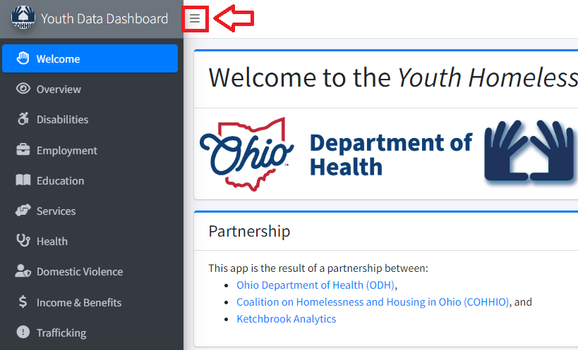
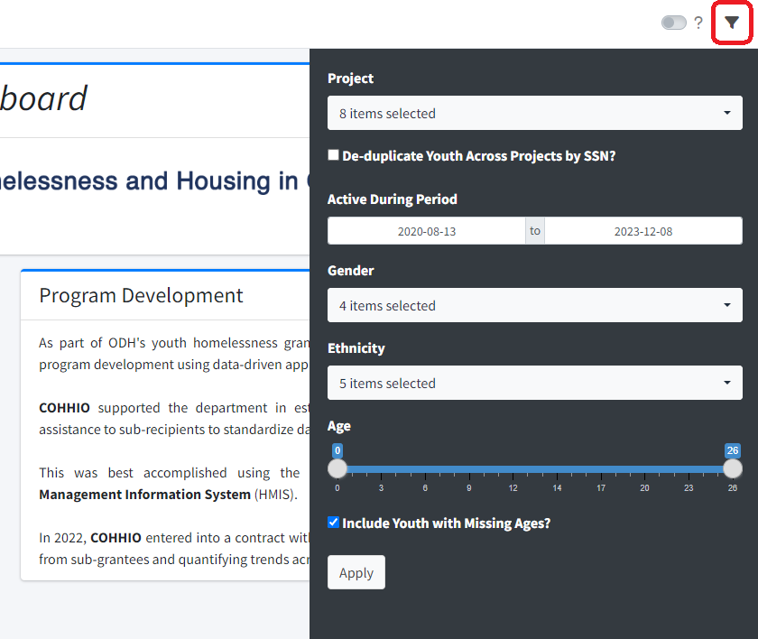
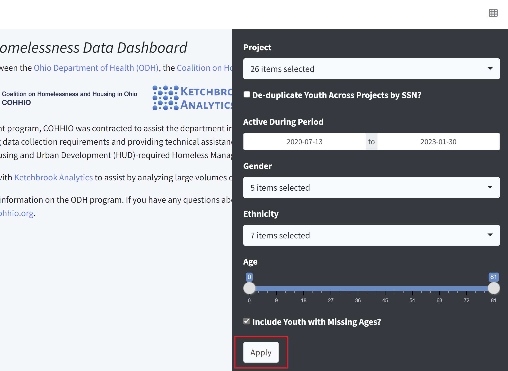
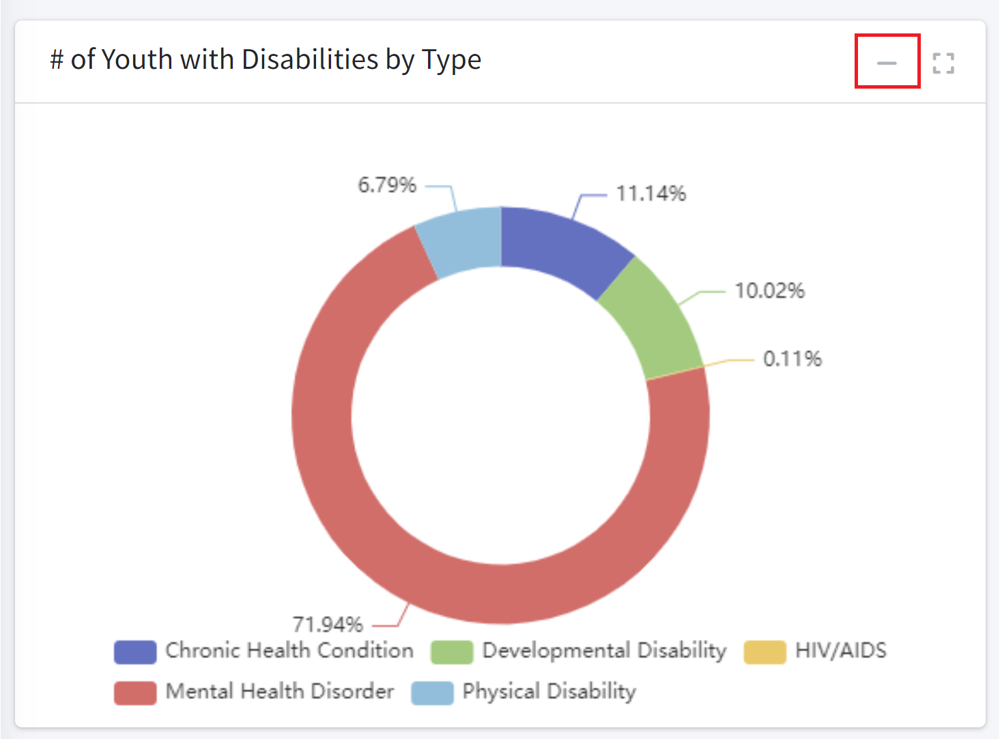

<h1 id="how-to-navigate-this-dashboard">How to Navigate this Dashboard</h1>

There are a few features of this dashboard that may help you navigate it more easily. 

Click on any section below to learn more.

1. [Showing/Hiding the Left-Hand Sidebar Menu](#showing-hiding-the-left-hand-sidebar-menu)
2. [Showing/Hiding the Right-Hand Sidebar Filters](#showing-hiding-the-right-hand-sidebar-filters)
3. [Applying Filters](#applying-filters-md)
4. [Collapsing/Maximizing the Charts and Tables](#collapsing-maximizing-the-charts-and-tables)

<h2 id="showing-hiding-the-left-hand-sidebar-menu">Showing/Hiding the Left-Hand Sidebar Menu</h2>

The left-hand sidebar menu allows you to **navigate** the different pages of the dashboard.

You can collapse or expand the left-hand sidebar menu by clicking on the *three horizontal lines icon* at the top of the page:

 

 
 

[Return to Top](#how-to-navigate-this-dashboard)

<h2 id="showing-hiding-the-right-hand-sidebar-filters">Showing/Hiding the Right-Hand Sidebar Filters</h2>

The right-hand sidebar menu allows you to **filter** the data displayed in the charts and tables in the dashboard.

You can collapse or expand the right-hand sidebar filters by clicking on the *funnel icon* at the top right of the page:

 

 
 

[Return to Top](#how-to-navigate-this-dashboard)

<h2 id="applying-filters-md">Applying Filters</h2>

After changing the selections in the filters, you *must* click the **Apply** button at the bottom of the filters panel in order to apply the filters to the data:

 

 
 

[Return to Top](#how-to-navigate-this-dashboard)

<h2 id="collapsing-maximizing-the-charts-and-tables">Collapsing/Maximizing the Charts and Tables</h2>

Each chart or table in the dashboard can be **maximized** by clicking on the *expand icon* in the top right-hand corner of the container:

 

Conversely, each chart or table in the dashboard can be **minimized** by clicking on the *minus sign icon*:

 
 

[Return to Top](#how-to-navigate-this-dashboard)

 
