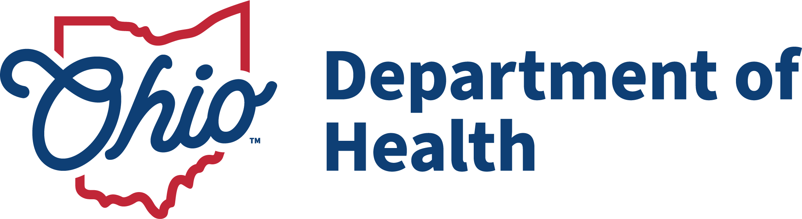
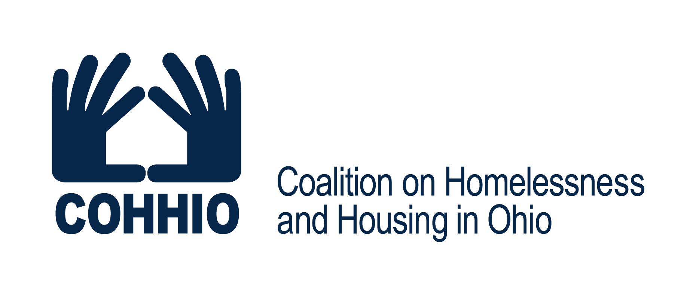
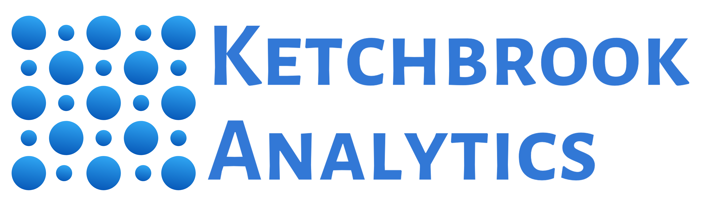

### Welcome to the *Youth Homelessness Data Dashboard*

This app is the result of a partnership between the [Ohio Department of Health (ODH)](https://odh.ohio.gov/), the [Coalition on Homelessness and Housing in Ohio (COHHIO)](https://cohhio.org/) and [Ketchbrook Analytics](https://www.ketchbrookanalytics.com).

  

    
     
    
  

As part of ODH’s youth homelessness grant program, COHHIO was contracted to assist the department in program development using data-driven approaches. COHHIO supported the department in establishing data collection requirements and providing technical assistance to sub-recipients to standardize data collection across the program. This was best accomplished using the Housing and Urban Development (HUD)-required Homeless Management Information System (HMIS).

In 2022, COHHIO entered into a contract with [Ketchbrook Analytics](https://www.ketchbrookanalytics.com) to assist by analyzing large volumes of data from sub-grantees and quantifying trends across data sets.

This app utilizes the HMIS CSV to provide information on the ODH program. If you have any questions about the app, please email Amanda Wilson, Youth Housing Initiative Director at COHHIO, at [amandawilson@cohhio.org](mailto:amandawilson@cohhio.org).

Please see the [Help](#tab-help_page) page on the left-hand sidebar menu for more information on how to navigate the app.
