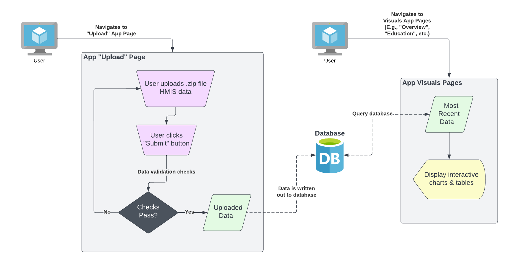

## Source

The data within this application are collected by each grantee in a format compliant with the *HMIS Data Standards*. This data originates from one of a few separate HMIS databases in the State. The HMIS databases have the capability to query the database and export a .zip file. This .zip file can be uploaded into the **COHHIO Youth Data Dashboard** app via the app's "*Upload*" page.

## Architecture

The following architecture diagram shows how the app can be used for both uploading (.zip file) HMIS data, and visualizing previously uploaded HMIS data.

## Requirements

The following requirements must be satisfied in order for the .zip file to be successfully processed and its data written to the database:

* The file must be *.zip* extension
* The .zip file must contain (at least) the following .csv files
  * **Client.csv**
  * **CurrentLivingSituation.csv**
  * **Disabilities.csv**
  * **EmploymentEducation.csv**
  * **Enrollment.csv**
  * **Exit.csv**
  * **Export.csv**
  * **Funder.csv**
  * **HealthAndDV.csv**
  * **IncomeBenefits.csv**
  * **Organization.csv**
  * **Project.csv**
  * **ProjectCoC.csv**
  * **Services.csv**
* The **Organization.csv** file must contain exactly one (1) organization
* The column naming conventions must match the expectations of the *ryha* database

## Data Dictionary

The data dictionary for each element across each file can be found [here](https://files.hudexchange.info/resources/documents/HMIS-Data-Dictionary-2024.pdf). This data dictionary was used to develop the package datasets, which are created in [data-raw](https://github.com/COHHIO/ryha/tree/master/data-raw) and stored in [data](https://github.com/COHHIO/ryha/tree/master/data).
