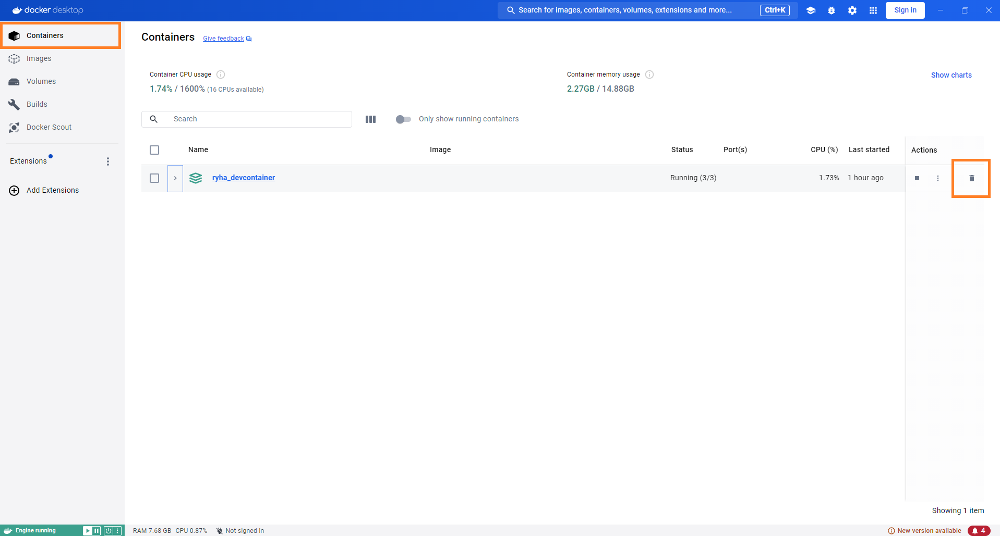

[.devcontainer](/.devcontainer) directory contains the necessary files to set up a [development container](https://code.visualstudio.com/docs/devcontainers/containers):

- [.env.example](/.devcontainer/.env.example) is an *example* file that shows how to set the `RENV_PATHS_CACHE_HOST` environment variable (required to configure `{renv}`'s cache) based upon Windows OS. **You need to create a file named** `.env` **in the same directory as** `.env.example` **and set** `RENV_PATHS_CACHE_HOST` **value to a path in your local machine based upon** [{renv}'s Cache location](https://rstudio.github.io/renv/articles/package-install.html?q=cache%20location#cache-location).
- [devcontainer.json](/.devcontainer/devcontainer.json) describes how VS Code should start the container and what to do after it connects.
- [docker-compose.yml](/.devcontainer/docker-compose.yml) sets up a development environment with three services:
  - `app`: A custom-built application container that mounts local directories and [runs indefinitely](https://kodekloud.com/blog/keep-docker-container-running/).
  - `db`: A PostgreSQL database container with [persistent storage](https://docs.docker.com/get-started/docker-concepts/running-containers/persisting-container-data/) and [exposed ports for access](https://stackoverflow.com/questions/52567272/docker-compose-postgres-expose-port). Check [db](#db) section for instructions on how to connect to, populate and launch the application connected to the database.
  - `pgadmin`: A [pgAdmin](https://www.pgadmin.org/) container for database management. Check [pgadmin](#pgadmin) section for instructions on how to configure the server.
- [Dockerfile.Dev](/.devcontainer/Dockerfile.Dev) contains a set of instructions on how to build the Docker image to run the application in development. **Any new system requirement needed for additional R packages installed must be added to this file**.
- [install_dev_packages.R](/.devcontainer/install_dev_packages.R) runs `renv::restore()` to restore the project's dependencies from the [renv.lock](/renv.lock) file. In addition, we use this script to install development packages (i.e. packages that are not needed to run the application but help during development, such as `devtools`). **Add or remove development packages from this script based on your preferences**. This script is run as a `postCreateCommand` in `devcontainer.json` to leverage `{renv}`'s cache.

### Requirements

- [Docker](https://docs.docker.com/engine/install/). We recommend installing it via [Docker Desktop](https://docs.docker.com/desktop/install/windows-install/).
- [VS Code](https://code.visualstudio.com/)
- VS Code's [Dev Container Extension](https://marketplace.visualstudio.com/items?itemName=ms-vscode-remote.remote-containers)

### QuickStart

Once you have installed the necessary requirements, cloned the repository locally and created the `.devcontainer/.env` file, open the repository in VSCode and click **Reopen in Container...**:


*NOTE*: Alternatively, you can select **Dev Containers: Reopen in Container** from the Command Palette (`F1`) to perform this action.

The Dev Container initialization may take a few minutes, as it needs to create different Docker images and install the corresponding R packages via `renv::restore()`.

The message `Done. Press any key to close the terminal.` in `TERMINAL` tab indicates that the process completed successfully:


*NOTE*: If you encounter any errors, you can review the logs to troubleshoot or contact a team member for assistance.

To launch an R Terminal, select **R: Create R terminal** from the Command Palette (`F1`). Alternatively, you can click the ``r intToUtf8(0x2304)`` icon in VS Code Panel and select **R Terminal**:


Remember to select the R Terminal in the right sidebar to open it.

### Exit Dev Container

To exit the Dev Container, click **Dev Container** (bottom left corner) and select one of the following commands:

- **Reopen Folder Locally**: This option will close the current Dev Container session and reopen the project folder in your local environment, outside of the containerized setup. It's useful when you want to switch back to your local development environment while keeping the same project open.
- **Close Remote Connection**: This will close the connection to the Dev Container and stop the container. The current workspace will be closed, and you'll be returned to the main VS Code window without any active workspace or connection.


### Remove Dev Container

*NOTE*: If you work on the project on a regular basis, it's not *necessary* to remove the Dev Container after you exit it.

To remove the Dev Container:

1. [Exit the Dev Container](#exit-dev-container)
1. Remove the container
1. Remove associated images
1. Remove associated volumes

**Warning**: Removing the volumes will delete the development database and any data you've uploaded, requiring you to repopulate the database after rebuilding. If you choose to delete **only** the container and its associated images (i.e. you don't delete the volumes), the development database will be available when you rebuild the Dev Container.

The following steps demonstrate how to remove the container, images and volumes using Docker Desktop. You can also use Docker's command-line interface to perform the same tasks.

#### Remove Container

1. Go to Containers tab
1. Locate the container associated with your Dev Container and click the corresponding trash icon to stop and delete it



#### Remove Images

1. Go to Images tab
1. Locate the images associated with your Dev Container and click the corresponding trash icons to remove them from your local Docker repository


#### Remove Volumes

1. Go to Volumes tab
1. Search for `ryha`
1. Select the associated volumes
1. Click **Delete**


### Container Details

The container uses [Docker Compose](https://docs.docker.com/compose/) to initialize the following **services**:

#### app

**app** creates a container based on [.devcontainer/Dockerfile.Dev](/.devcontainer/Dockerfile.Dev). This file:

- installs the R version used in this project
- installs R packages' system requirements
- installs the `{renv}` version used in this project

In addition, **app** service defines a [Volume](https://docs.docker.com/storage/volumes/) to leverage the use of `{renv}` cache. The `RENV_PATHS_CACHE_HOST` environmental variable needs to be set in `.devcontainer/.env`. Resources:

- [{renv}'s Cache location](https://rstudio.github.io/renv/articles/package-install.html?q=cache%20location#cache-location). This article helps to find where `{renv}`'s cache is located in your machine.
- [This GitHub Issue comment](https://github.com/docker/for-win/issues/2151#issuecomment-662343075) shows examples on how to state the path when working with a Windows machine.

By setting the `network_mode` property to `service:db`, we can use `host = "localhost"` when connecting to the development database from inside the Dev Container. This configuration ensures that the connection string remains the same regardless of whether we are connecting from inside or outside the Dev Container (when the `ports` property is set for `db` service). Without `network_mode` setting, we would need to use `host = "db"`, resulting in different connection strings depending on the context, which is something we want to avoid.

To run the app in development mode (without installing the {ryha} R package), run `golem::run_dev()`.

#### db

**db** creates a postgreSQL database. You can find the credentials under `db`'s `environment` property in [.devcontainer/docker-compose.yml](/.devcontainer/docker-compose.yml).

The `ports` property allows the database to be accessible in the host machine (i.e., outside of the Dev Container). With this property set, the connection string will use `host = "localhost"` for external access.

This configuration ensures that the connection string remains the same regardless of whether we are connecting from outside or inside the Dev Container (when the `network_mode` property is set for `app` service).

##### Connect

You can connect to the development database using the following code:

```{r, eval=FALSE}
# Connect to dev database
con <- DBI::dbConnect(
  drv = RPostgres::Postgres(),
  dbname = "ryha-dev",
  host = "localhost",
  port = 5432,
  user = "ryha-dev",
  password = "ryha"
)
```

##### Populate

Once the container is created, you can run [postgres/populate_dev_database/populate_dev_database.R](/postgres/populate_dev_database/populate_dev_database.R) to create and populate the corresponding tables. To run this script you need to:

- Store `dm.rds` in the directory `postgres/populate_dev_database/data`. `dm.rds` is a snapshot of the database in production. It needs to be created by someone with access to the production database. The process to generate this object is to read each table in the database into a list of dataframes where each element is named after the table name the data was read from.
- Run `devtools::load_all(".")` to have access to the different functions in `ryha` that are used in the script (e.g. `send_to_db()`).

##### Use in App

Once the container is running, you can set the environmental variable `APP_BACKEND` to `dev` in `.Renviron` to run the application connected to the development database.

#### pgAdmin

**pgAdmin** provides a graphical administration tool to make it easier to manipulate schema and data in PostgreSQL. Once the container is created, you can access pgAdmin in http://localhost:5050/ with the following credentials (which are defined under `pgadmin`'s `environment` property in `.devcontainer/docker-compose.yml`):

- User: `admin@secret.io`
- Password: `admin`

*NOTE*: pgAdmin may not function correctly in all web browsers. We recommend using Google Chrome.

Once logged in, follow these steps to Register the Server:

1. Go to `Object > Register > Server...`. Alternatively, you can right-click `Servers` as shown below:


2. In `General`, provide a `Name` for the server. For example: `dev-db`.


3. In `Connection`, set the following configuration:

- Host name/address: `db`. This value needs to match the **service** name.
- Port: `5432`
- Maintenance database: `ryha-dev`
- Username: `ryha-dev`
- Password: `ryha`

Maintenance database, Username and Password were defined under `db`'s `environment` property in `.devcontainer/docker-compose.yml`.


4. Click `Save`. If the development database was already populated, you should be able to see the tables with data:


